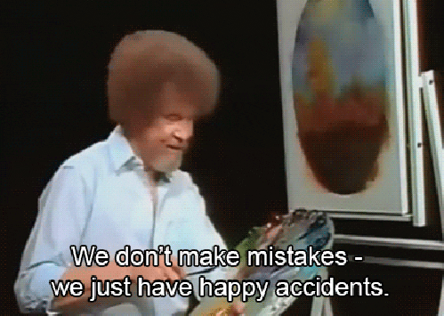
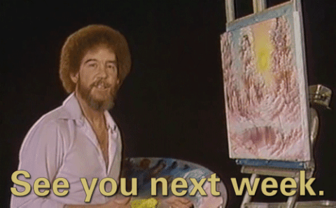

# Bob Ross or Not?

# Detecting Imitations of Bob Ross Paintings using Convolution Neural Networks

| |
| :-: |
| Bob Ross painting on his show, The Joy of Painting |

Bob Ross was one of the most prolific painters of the 20th Century. He painted over 30,000 works during his lifetime. Many people know him from his TV show, The Joy of Painting, which ran on PBS from 1983 to 1994. Bob Ross invited viewers of his show to learn and enjoy painting, particularly in his style of 'wet on wet' painting, leading to many amateur imitators and fans of his style. Currently, and despite his prolific career, very few paintings are publicly known to be owned or sold. According to the New York Times, many of his paintings are currently stored at the headquarters of Bob Ross Inc., and some are even part of the collection of the Smithsonian Institution.

# Business Understanding

There are no official authenticators of Bob Ross' work and paintings. Furthermore, because of his many fans, there are thousands of paintings made by amateur and professional imitators of his style. Some fakes and many imitations are sold across the internet, but is there a way to authenticate any work to the artist?

Detecting fakes of artwork is a difficult task in machine learning. Due to the similarity between real artworks and fakes, it can be hard to find the differences between images. This notebook attempts to use a convolutional neural network that can be trained to recognize the work of Bob Ross, from any imitation. Furthermore, it can theoretically be used to authenticate any artist or detect anomalies in medical imaging, and many other fields of machine learning.

# Data Understanding

Bob Ross painted 30,000 works in his lifetime, but relatively very few images are publicly available for download on the internet. The Joy of Painting ran 403 episodes and for every episode, Bob painted a picture that was captured in video. Twoinchbrush.com is a website dedicated to the work of Bob Ross and has compiled every painting that was painted on air, as well as images submitted from people painting under Bob's broadcasted teaching.

Our dataset includes the 403 paintings that Bob painted on the Joy of Painting, captured from Youtube screenshots, as well as any additional paintings that can be verified to be Bob's, found on the internet. In addition to the original artworks, we have included the full set of imitators artworks collected from Twoinchbrush.com to use in comparison.
When it comes to detecting fakes in artworks, it would be ideal to use extremely high-resolution images of the work, in order to see all details in the color information of each painting, but at this time this is all we can acquire.

# Problems and Possible Solutions

Our training set is very small, and there is a massive class imbalance between real Bob Ross paintings and paintings by imitators. Also, some images are high resolution, and downsampling these images before insertion into the neural network, leads to a loss of information that could be important in modeling and determining the true artist.

In order to create a larger training set and improve the accuracy of the model, we implemented an idea from this [article](https://spectrum.ieee.org/the-rembrandt-school-of-ai-an-algorithm-that-detects-art-forgery) that found a possible solution to the class imbalance and small training set problem for detecting fakes of artworks. First, we slice up the images into small tiles samples of each painting. Then we take the tiles with the highest entropies, using Claude Shannon's formula for information content, and add those to the training set. By using subsets of the information of each painting, the model focuses on the details of each painting, without having to downsample an entire high-resolution painting to a small image that can be inserted into the neural network. In effect, we use the parts of the painting that have the highest levels of information while also multiplying the size of the training set by many times.

# Our Model

For this experiment, we used a multi-layer convolutional neural network with 4 convolutional layers followed by max pooling layers. After the convolutional layers, I used one fully connected layer before the final one-node layer that determines the authenticity of each artwork. Additionally, we added a dropout layer of 10% after the first convolutional layer.

The final model has around 95% validation accuracy for determining whether an artwork is by Bob Ross or not.

# Predictions

Since we slice up each image into tiles before training our model, we will need to do the same when predicting any additional works that go through the model. We created a helper function that slices up each image, takes 10 tiles with the highest informational entropy, and predicts the artist based on the mean of those 10 predictions. Therefore, by pooling the predictions of each tile, even if the accuracy of the model is 95%, the final accuracy will be the equivalent of multiplying that 95% accuracy probability ten times, which would lead to a 59% approximate accuracy overall. If selecting fewer tiles when predicting each work, the model is more accurate but uses much less information for prediction.

# Results 

According to our test set, our model is able to correctly classify whether a painting is an original Bob Ross painting with over 90% accuracy, even when the painting is in the 'Bob Ross Style' or painted under his instruction. 

We believe this model proves that an artist's style and unique way of creating is not duplicatable, and that machine learning can be used to detect forgeries in artworks. Even when an artwork closely resembles the original artwork or artist, our model can correctly classify the artist's handiwork.

Moreover, we believe this method has wide ranging implications in the field of image analysis. A similiar preprocessing technique of slicing an image in sections and retaining the most important information, as described in this [paper](https://spectrum.ieee.org/the-rembrandt-school-of-ai-an-algorithm-that-detects-art-forgery), can be used as a general model for detecting forgeries in artworks by other artists, but also as a tool for correctly classifying anomalies in other images, such as in the field of medical imaging analysis.

Our next steps, include augmenting our dataset with higher quality images of the work of Bob Ross, as well as extending this model to detect the forgeries of other major artists that have limited dataset or small samples of work publicly available.

